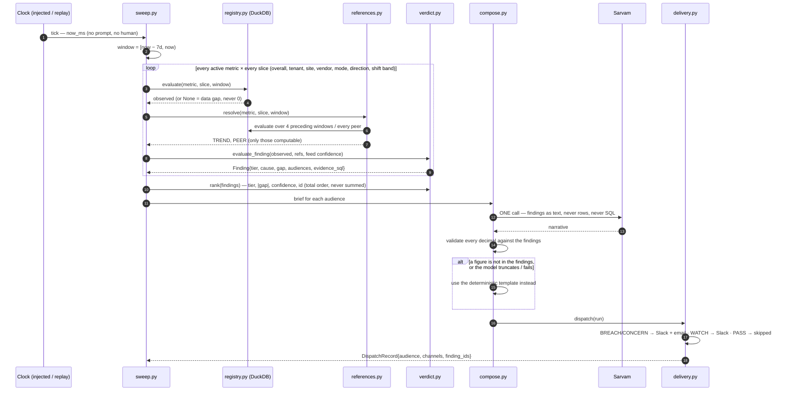

# Signal Desk — architecture

One stateless Python service, an embedded database, a thin React console. Four
layers and **one hard seam**: everything left of the seam is deterministic and
unit-tested; everything right of it produces language and nothing else.

## The system

```mermaid
flowchart LR
    subgraph DATA["Provided dataset (CSV, 570 MB)"]
        T[trips · 615,546]
        L[emp legs · 1,637,906]
        B[bill lines · 620,942]
        F[ratings · 512,873]
        A[alerts · 51,699]
    end

    subgraph SVC["service/signaldesk — one FastAPI process"]
        direction LR
        ING["ingest.py<br/>tolerant load → DuckDB tables<br/>rejects quarantine · gap register<br/>normalised views · per-feed confidence<br/><b>SQL allowed</b>"]
        REG["registry.py<br/>metric definitions (governed vocabulary)<br/>slices bound as parameters<br/>evidence_sql for every number<br/><b>SQL allowed</b>"]
        REF["references.py<br/>4-week trend · peer median<br/>omitted, never faked"]
        VER["verdict.py<br/>pure: no I/O, no clock, no model<br/>signed gap · four ordinal tiers<br/>confidence cap · rank · audiences"]
        SWP["sweep.py<br/>SENSE on an injected clock<br/>ReplayClock (a day per second)<br/>in-process run store"]
        CMP["compose.py<br/>template brief (deterministic)<br/>Sarvam brief → <b>numeric validator</b><br/>fallback to template"]
        MDL["model.py  [MODEL]<br/>SarvamClient · one call per brief<br/>token + rupee cost meter"]
        DLV["delivery.py  ACT<br/>Slack webhook · SES email<br/>routed by tier · dispatch log"]
        API["api.py<br/>/api/sweep · /runs/{id}/findings<br/>/brief · /dispatch · /health · /cost · /replay"]
    end

    subgraph OUT["Where it lands"]
        SL[Slack channel]
        EM[Email]
        UI["console/ (React 19)<br/>ranked findings → evidence SQL<br/>feed health · brief preview · cost"]
    end

    DATA --> ING --> REG
    REG --> REF --> VER
    REG --> VER
    VER --> SWP --> API
    SWP --> CMP --> DLV
    CMP <--> MDL
    DLV --> SL
    DLV --> EM
    API --> UI

    classDef sql fill:#fde68a,stroke:#b45309,color:#111;
    classDef pure fill:#bbf7d0,stroke:#15803d,color:#111;
    classDef model fill:#fecaca,stroke:#b91c1c,color:#111;
    class ING,REG sql;
    class REF,VER,SWP pure;
    class MDL model;
```

Colour key — **amber:** the only two modules allowed to contain SQL (a grep test
enforces it). **green:** deterministic and unit-testable, no I/O in the verdict
engine. **red:** the only module that talks to the model, and it never sees a
row, a table or a query — only settled findings.

## One sweep, step by step

## The decisions the architecture encodes

| Decision | Consequence |
|---|---|
| **The model never computes a number and never writes SQL.** There is no `run_sql` tool; a test enforces it. | Nothing on screen can be a hallucinated figure. The narrative validator rejects any decimal not present in the findings and falls back to the template. |
| **Rules are pure functions.** `verdict.py` has no I/O, no clock, no model. | The reasoning is unit-testable, and *break-it-to-prove-it* — delete the guard, watch the named test fail, restore — is how every rule was landed. |
| **A metric without a reference point emits nothing.** Every metric declares ≥1 of trend / peer (/ target); a reference that cannot be computed is omitted, never faked. | "OTA is 78%" is never shown alone; it is always "against a 4-week average of X and a peer median of Y". |
| **Thresholds are measured, then pinned.** Tier bands are calibrated per metric direction against the real dataset and the measurement is recorded beside the constant. | No wall of red: the ranking discriminates. |
| **Tiers are ordinal, never summed.** `rank` is a lexicographic order. | Twenty WATCHes can never outrank one BREACH. |
| **Messy data is counted, not hidden.** Rejects are quarantined per feed; confidence = 1 − (rejected + unmatched + null-critical) / considered. | The brief discloses a feed below 0.9 confidence, and low confidence caps severity at WATCH — it never raises it. |
| **An injected clock.** No wall-clock reads in the sweep path. | Same data + same clock → identical findings (tested). The replay clock advances at a configurable speed (default one simulated day per real second) so 90 days play out in 90 seconds on stage; production is the same loop with the clock set to now. |
| **Data behind one seam.** `source_for(base)` returns local files today and `s3://…` via `httpfs` tomorrow. | Deployability is an argument to a function, not a rewrite. Proven on Render (`render.yaml`, deploy docs in the README): the deployed instance runs on `data/sample`, same code and sweep, smaller numbers. |
| **One model call per brief, over aggregates** (two if the first truncates). | The prompt is ~550 tokens for eight findings; `sarvam-105b` then spends a variable 2,000–15,000 reasoning tokens (measured, 13 real calls). At ₹0.048/1k that is **≈₹0.13–0.77 per brief**, ~₹12–70/month for three briefs a day — and flat whether the client has 500 or 50,000 employees, because the model sees eight findings, never rows. |

## Cost and latency, measured

- Sarvam blended rate, measured from the dashboard: ≈₹0.048 per 1k tokens (±17%; say "fractions of a rupee").
- `load_all` of the full dataset into DuckDB: **≈4.6 s**. One full sweep — 5 metrics × ~56 slices, with trend and peer fan-out memoised: **≈26 s** on 615k trips (Tier 2 instruments p50/p95 per query).

## Boundaries, on purpose

Not built: forecasting, vernacular feedback (the dataset has no free text), auth,
a historical pipeline, vendor-system integration, write-back. The dimension for
multi-tenancy (`business_unit`, five real values) exists and per-tenant
thresholds are one dict; row-level isolation does not.
